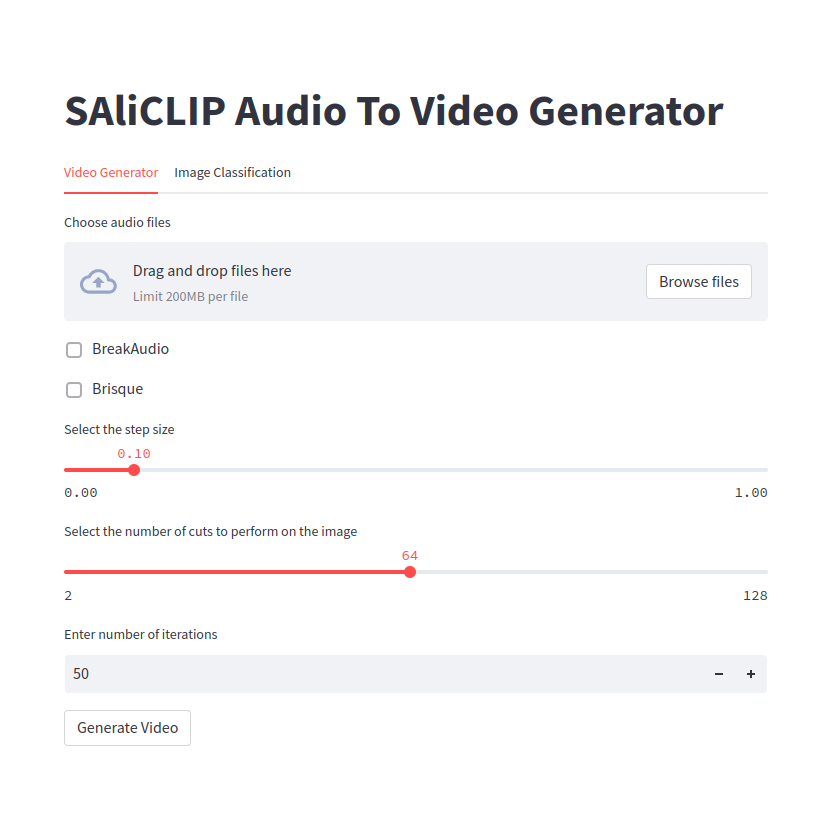
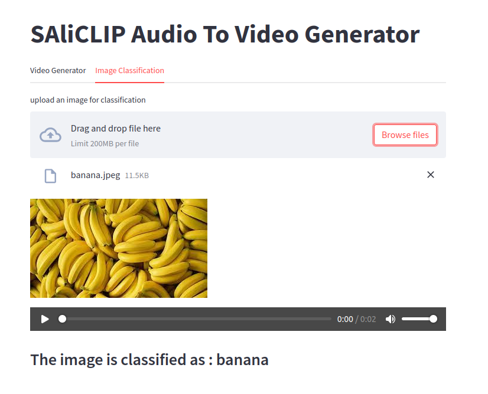

# SAliCLIP
The advent of the Transformer architecture, followed by the development of contrastive models like OpenAI’s CLIP, has enabled learning robust latent space representations of data in multiple modalities such as text and image. In this work, we present Speech-Aligned CLIP (SAliCLIP), developed by employing knowledge distillation to adapt an audio encoder to the embedding space of CLIP. Aligning the embedding spaces of image, speech, and text imparts additional functionality to CLIP, which can be leveraged for various downstream tasks. We utilize this framework of encoders to guide the images generated by a GAN-based network to represent any given speech signal. The proposed architecture achieves new state-of-the-art cross-modal retrieval and classification accuracies on the Spoken-COCO dataset, the Spoken ObjectNet dataset and the Flickr Audio Captions Corpus dataset which includes zero-shot learning and fine-tuning on these datasets.
## Config file
The config file contains multiple paramaters which are required to run SAliCLIP. The Device that has to be used can be changed in the config file. By default the device that will be used is cpu. This can be changed by making device = cuda for GPU . </br>
**Note** : Check the hardware requirements before doing this change.
## Installation
```Python 3``` or higher is recommended. We encourage that you use a python virtual enviornment to run SAliCLIP.
### Installing required libraries
For linux and windows
```
pip install -r requirements.txt --extra-index-url https://download.pytorch.org/whl/cu113
```
For Mac
```
pip install -r requirementsMac.txt 
```
## SAliCLIP Model
The SAliCLIP Model should be downloaded from here : https://drive.google.com/file/d/1cttNVMHIRxYpDCYFatXe2WKM-pIQcUA0/view?usp=sharing
### Environment Setup
Before running the below command make sure your system has [git](https://www.atlassian.com/git/tutorials/install-git) and [curl](https://help.ubidots.com/en/articles/2165289-learn-how-to-install-run-curl-on-windows-macosx-linux) commands installed.
```
python3 EnvSetup.py
```
## Running SAliCLIP
```
streamlit run Main.py
```
## Hardware Requirements
### CPU Requirements
16 GB RAM or higher 
### GPU Requirements (Optional, program will run faster)
25 GB RAM or higher
## Interface
Once the Main file is run the following interface will open up.
</br>

</br>
In the **Video Generator** tab, a user can input multiple audio files up to 200MB. Once the audio is uploaded it can be played in the interface. Then the user is given a choice to change some video generating parameters such as step size, cuts, number of iterations, break audio, and BRISQUE.</br> 
+ Step Size - This is the learning rate for the VQGAN Model.
+ Cuts - The number of cuts to perform in the generated image before sending it to the image encoder.
+ Number of Iterations - The number of times an output image is generated. The loss is calculated between the output image and the input audio, and the loss is back propagated such that the input is changed in the latent space to generate a better image.
+ Break Audio - Selecting this option breaks the input audio into 2 parts and loss is calculated separately for these 2 parts and is added to the total loss of the audio and image. Less weight is given to these 2 losses, this is because the overall context of the audio should not be lost.
+ BRISQUE - Blind Reference Image Spatial Quality Estimator(BRISQUE) is calculated for the generated image at each epoch. A BRISQUE score of 0 indicates the highest quality image whereas a BRISQUE score of 150 indicates an extremely poor quality image, it takes into account factors such as sharpness of features, image clarity, pixel distribution, etc. to judge the quality of an image.</br>
</br>
These audio clips are finally converted to a video which is later displayed with the audio of the corresponding audio clip.</br>
</br>

</br>

In the <b>Image Classification</b> tab, a user can input an image up to 200MB. Once the image is uploaded, the model gives an output predicting the class to which the image belongs. These classes can be found in the ListOfClassesForClassification.txt file.  

